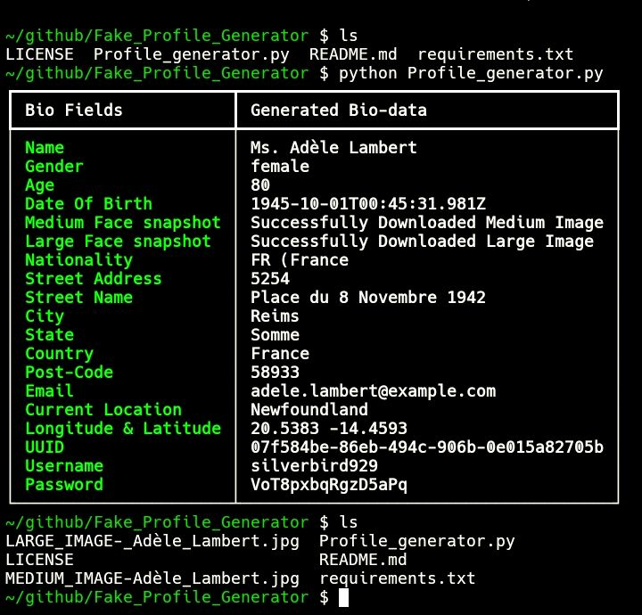

#-- Fake Profile Details Generator --

This is my first Python project 🎉  
It generates random user bio random details such as names, ages, and emails.

## Features
- Generates random details
- with extra generated details
- User friendly interface
- Easy to run




## Installation
Clone this repository:
```bash
git clone https://github.com/u112000/Fake_Profile_Generator

cd Fake_Profile_Generator && python3 Profile_generator.py
